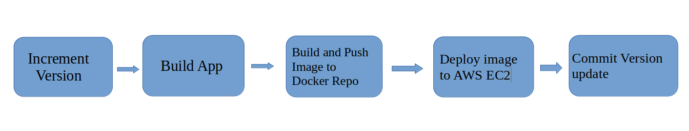

# Run java-maven Docker image to AWS EC2 Instance



### Push image to Private Repository (Docker Hub)

#### Login to docker hub
```sh
  docker login
```

#### Create Docker image locally
```sh
  docker build -t java-maven-1.0 .
```

#### Tag the image
```sh
  docker tag java-maven-1.0:latest username/repo-name:java-maven-1.0
```

#### Check the Docker image locally
```sh
  docker images
```

#### Push image to Docker Hub
```sh
  docker push username/repo-name:java-maven-1.0
```


#### Login to Remote host (EC2 Instance)
```sh
  ssh -i ~/private-keys.pem ec2-user@public-ip
```

#### Install Docker on EC2 server
```sh
  sudo yum install docker
```

#### Start Docker Daemon
```sh
  sudo service docker start
```

#### Add ec2-user to docker group
```sh
  sudo usermod -aG docker $USER
```

#### Login to Docker Hub
```sh
  docker login
```

#### Pull the image from Private Repository
```sh
  docker pull username/repo-name:java-maven-1.0
```

#### Run the Docker image
```sh
  docker run -d -p 8080:8080 username/repo-name:java-maven-1.0
```

Now open the port 8080 from EC2 instance inbound rule.

Go to Browser and Type
```sh
  public-ip:8080
```
