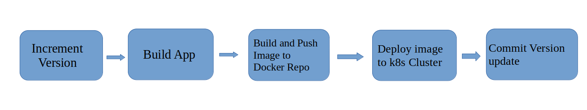

# complete CI/CD pipeline with EKS and ECR



## Deploy docker image to EKS k8s cluster using AWS-ECR/DockerHub Docker Repo

#### Creating EKS Cluster using eksctl
```yaml
    $ aws configure list
    $ eksctl version
```

```yaml
    eksctl create cluster \
    --name demo-cluster \
    --version 1.27 \
    --region ap-south-1 \
    --nodegrop-name demo-nodes \
    --node-type t2.micro \
    --nodes 2 \
    --nodes-min 1 \
    --nodes-max 3
```

With eksctl, we can also create a config file and pass to the eksctl then create eks k8s cluster
and advantage of it is that we have the history/track of the config file. We can also edit and manage
the cluster with the help of config file.


### We'll setup AWS ECR to pushing and pulling docker images.

#### For pushing images
- create AWS ECR Repo
- create credentials in Jenkins <br>
        ```credentials -> global -> add creds -> username & password``` <br>
        id - ecr-credentials <br>
        password - Get using this command $ aws ecr get-login-password
- create secret for AWS ECR
- Update jenkinsfile

#### For pulling images
- create secret for AWS ECR
    It uses when kubectl apply command executes to fetch images from inside k8s

    - create secret for DockerHub repository
    ```yaml
    $ kubectl create secret docker-registry aws-registry-key \
      --docker-server=docker.io \
      --docker-username=piyush168713 \
      --docker-password=******
    ```

    - create secret for AWS ECR private repository
    ```yaml
    $ kubectl create secret docker-registry aws-registry-key \
      --docker-server=**********.dkr.ecr.ap-south-1.amazonaws.com \
      --docker-username=AWS \
      --docker-password=*** (get password from $ aws ecr get-login-password)
    ```

#### Deployment Stage

```Jenkinsfile10```
```yaml
        stage('deploy') {
            environment {
               AWS_ACCESS_KEY_ID = credentials('jenkins_aws_access_key_id')
               AWS_SECRET_ACCESS_KEY = credentials('jenkins_aws_secret_access_key')
               APP_NAME = 'java-maven-app'
            }
            steps {
                script {
                   echo 'deploying docker image...'
                   sh 'envsubst < kubernetes/deployment1.yaml | kubectl apply -f -'
                   sh 'envsubst < kubernetes/service1.yaml | kubectl apply -f -'
                }
            }
        }
```

This piece of code is basically say :-

kubectl command executes which will use the ```kubeconfig.yaml``` which we placed inside jenkins container
at location ```/$USER/.kube/``` .
and inside that config file it is configured that iam authenticator needs to be used in order to authenticate with the AWS account
and when aws iam authenticator command get triggered in the background as a result it needs credentials to connect with the AWS account
so those two will be used (access key and secret access key) to authenticate that are set in env variable ```Jenkinsfile10```.

when we execute this ```kubectl apply``` with the deployment yaml file and we set the new image name in deployment yaml file
(```/kubernetes/deployment.yaml```), 
kubernetes must be allow to fetch the new image from the private (AWS ECR) repository, so we need authentication with the registry 
from inside k8s cluster.
we'll create secret from our local machine when connected to eks cluster.
and put imagePullSecrets in deployment file with name of secret ```aws-registry-key```, everytime k8s check this config(deployment) file, 
it see a private repo and image that have to fetch from there, it will needs the registry credentials, so it will take from the secrets inorder to pull the image. now deploy it using a new image version into the k8s cluster. 